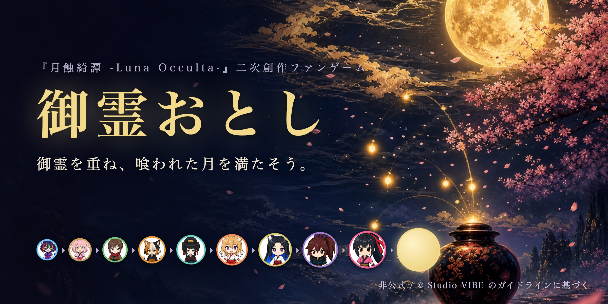

# 御霊おとし（みたまおとし）

『月蝕綺譚 -Luna Occulta-』の**非公式二次創作**ファンゲームです。
ちび御霊を壺に落として、同じ御霊同士を重ねると一段上の御霊へ「浄化」。
最後には満月が生まれ、満月がふたつ重なると「皆既月蝕」——。

スイカゲーム式の落ち物パズル。スマホのブラウザでそのまま遊べます。

**▶ 遊ぶ: https://hirohgxx.github.io/mitama-otoshi/**



## 遊び方

- 画面をなぞって位置を決め、指を離すと御霊が落ちます
- 同じ御霊がぶつかると合体して一段上の御霊になります
- 壺からあふれたらおしまい（夜明け）

### 進化の階梯

ネム → 於兎 → 餡音 → ネコマタ → 弁天 → 宇迦 → イズナ → 紫苑 → 咲耶 → 満月

## 開発

```bash
# 顔アイコン（assets/faces/*.png）を data URI 化して src/faces.js を生成
./scripts/build-faces.sh

# 単一ファイル版を dist/ に生成（index.html / artifact.html）
node scripts/build-dist.js
```

- 物理エンジン: [Matter.js](https://brm.io/matter-js/)（MIT・`vendor/` に同梱）
- `index.html#autotest` で開くと自動プレイのデバッグモード

## 二次創作について

本作は『月蝕綺譚 -Luna Occulta-』（Studio VIBE / CryptoNinja 外伝）の
[二次創作ガイドライン](https://vibe.co.jp/luna-occulta/fanworks)に基づくファンメイド作品で、**公式とは関係ありません**。
キャラクター画像は公式配布の正典シート（ちびシート）を作画資料・素材として利用しています。
キャラクターおよび原作の権利は原権利者に帰属します。
